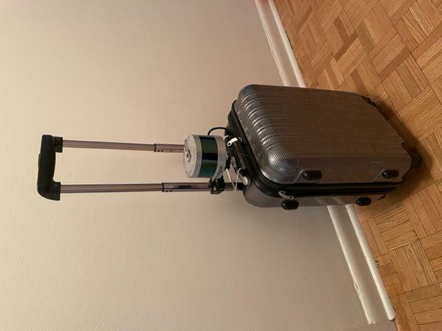

# Customization

## Build own cabot driver for your robot

- This repository uses `cabot-drivers` and `cabot-description` repositories for managing hardware components and describing the robot
  - these repositories will be imported by `./setup-dependency.sh` script which uses `vcs` command to import repos described in `dependency.repos` files
  - `cabot-navigation` repository also has dependency to `cabot-description` which is used for gazebo simulation
- You can modify those repositories and this `cabot` repositories to build your own cabot-navigation compatible robot
  - simplest way is to fork those repositories to your own space, and modify `dependency.repos` to points to your repository
  - make sure all dependency.repos points to your forked repositories
  - you may use `./setup-dependency.sh -c` to remove cloned repository first then run `./setup-dependency.sh` to clone correct one
```text
- cabot
  - dependency.repos               <- modify
  - cabot-common
  - cabot-description
  - cabot-drivers
    - dependency.repos             <- modify
    - cabot-common
    - cabot-description
  - cabot-navigation
    - dependency.repos             <- modify
    - cabot-common
    - cabot-description
  - cabot-people
    - cabot-common
```

### requirements

- define own `CABOT_MODEL` for example `cabotX-1`
  - `CABOT_MAJOR` will be first 6 letters of your `CABOT_MODEL` (i.e., `cabot-X`)
- `cabot-descrption/cabot_description/robots/{CABOT_MODEL}.urdf.xacro.xml` (i.e., `cabotX-1.urdf.xacro.xml`)
  - this file will be used in `cabot-drivers` (pyshical robot) and `cabot-navigation` (gazebo simulation)
  - please refer to existing URDF descriptions and check [README of cabot-description](https://github.com/CMU-cabot/cabot-description)
- cabot-drivers will launch `cabot_base` `{CABOT_MAJOR}.launch.py` (i.e., `cabotX.launch.py)
  - you can modify launch script at `cabot-drivers/script/launch_driver.sh`
  - refers to the [README of cabot-drivers](https://github.com/CMU-cabot/cabot-drivers) to see required servies/topics

## Build own cabot site (map) for your environment
- cabot site package
  - Required components
    - [config files](map-config-format)
    - localization map/data for Cartographer
    - static map image for Navigation2
    - MapService server data (local/remote)
  - Optional components
    - world files for gazebo simulation
    - localization map/data and static map images made for gazebo worlds
    - menu configuration and i18n strings
  - Directory structure
    ```text
    cabot_site/
    ├ config
    ├ i18n
    ├ maps
    ├ menu
    ├ server_data
    └ worlds
    ```

### Example
- See [example cabot site for CMU campus](https://github.com/CMU-cabot/cabot_sites_cmu/tree/dev-ros2/cabot_site_cmu_3d)

### Deployment

- place cabot site package under `cabot_sites` directory
- run `./build-docker.sh -w`
- set `CABOT_SITE` to your cabot site package name

## Mapping with Cartographer
- You need to walk around your environment with your robot or a device equipped suitcase to scan and build the map the place
  - walk slowly (less than 1.0m/s) and cover entire space
  - it would be better to have a round trip for all possible topology (corridors, rooms, spaces separated by large objects, and etc)
  - example of a device-equipped suitcase (using a [camera mount with a clamp](https://www.smallrig.com/smallrig-crab-shaped-clamp-magic-arm-with-ball-head-3724.html), IMU device would be mounted on the LiDAR)
    - 
- Required data, devices, and software
  - **Point clouds**: Velodyne VLP16
  - **IMU**: Xsens, or BNO055 managed by Arduino or ESP32)
    - see [xsens_driver](https://wiki.ros.org/xsens_driver) for compatible devices
    - [Code for Arduino + BNO055](https://github.com/CMU-cabot/cabot-arduino)
      - tested with [Arduino Mega](https://store.arduino.cc/products/arduino-mega-2560-rev3)
    - [Code for ESP32 (Wi-Fi) + BNO055](https://github.com/CMU-cabot/cabot-arduino-ace)
      - tested with [SparkFun Thing Plus](https://www.sparkfun.com/products/15663) + [BNO055](https://www.adafruit.com/product/4646) connected by a [Qwiic cable](https://www.adafruit.com/product/4399)
  - **Wi-Fi signals**: ESP32 compatible device with Wi-Fi antenna
    - [Code for ESP32 (Wi-Fi)](https://github.com/CMU-cabot/WiFiScan)
      - tested with [ESP32 devkitc-v4](https://docs.espressif.com/projects/esp-idf/en/latest/esp32/hw-reference/esp32/get-started-devkitc.html)
  - **Bluetooth signals**: PC with Bluetooth
  - **CPU**: PC for Ubuntu20.04
- Procedure
  - [build docker images](../README.md#build-docker-images)
  - start scannning and walk
    ```bash
    ./mapping-launch.sh -o TEST1 -e           # use ESP32 for IMU with prefix TEST1
    ./mapping-launch.sh -o TEST2 -x           # use XSENS for IMU with prefix TEST2
    ./mapping-launch.sh -o TEST3 -a           # use Arduino for IMU with prefix TEST3
    ```
    - these commands record topics into a bag file for post processing
    - the bag file started with the prefix you specified can be found under docker/home/recordings

  - run post processes the bag file (would be better to use PC with at least 6 core and 16GB)
    ```bash
    ./mapping-launch.sh -p <bag file>
    ./mapping-launch.sh -p <bag file> -w     # if the bag file is more than a few minitues, this option would be better
    ./mapping-launch.sh -p <bag file> -w -n  # the script will not skip previously completed tasks
    ```
    - post processes consist of 1) converting packets topics to pointcloud topics 2) running cartographer for SLAM 3) making a pgm image file from cartographer submaps
    - you can find the result under docker/home/post_process (the specified bag file will be copied here)

- Issues with mapping a large environment?
  - run cartographer with reduced rate (like `-r 0.5`), if your computer has smaller number of cores
  - please consult at [Issues](/issues), you may need to configure cartographer params to get a better result

- Align the map to global coordinate
  - prepare [MapService server](https://github.com/daisukes/MapService/tree/hokoukukan_2018-docker) (need to use hokoukukan_2018-docker branch as of 2022.06.02)
    - the easiest way is to use a local server
      - **note**: database is not persistent, [admin password is the default value](https://github.com/hulop/MapService/blob/master/MapService/SETUP.md#administration)
    ```bash
    ./build-docker.sh server
    ./server-launch.sh -d cabot_sites/cabot_sites_cmu/cabot_site_cmu_3d/server_data
    xdg-open http://localhost:9090/map/floorplans.jsp
    ```
  - add a floorplan
    - click "Add a floorplan" button to show a form to make a floorplan
    - Name: the map image name (ex. airport-1st-floor
    - Select a file: the map image file (transparent PNG file would be better, you can make it by removing background gray of the generated pgm file)
    - Type of image: Floor map
    - Group Name: the map image group name (ex. airport
    - Floor: 1st floor = 0, 2nd floor = 1, ..., 1st basement floor = -1, ...
    - Oring X and Y: will be edited later
    - PPM x and y: 20 (cartographer conversion default)
    - Anchor: will be edited later
    - z-index: change if you have multiple images on a single floor and want to control the z order. with larger number will be in front.
    - click "Submit"
  - edit the origin of the image
    - click "edit" button of a floorplan
    - click the text input of Origin X or Origin Y
    - click the origin point on the map image
      - if you have multpile floors, you may want to use the location where you can align easily, for example the door position of an elevator
    - click "Submit"
  - edit the anchor of the image (world coordinate)
    - refresh the page make sure the data is the latest (after eiditing the origin)
    - click "map" button of a floorplan
    - scroll down to the bottom of the page
    - you can type latitude and longitude if you know the approximate coordinate
    - otherwise, zoom out the map and find your place
    - input rotate value to align the image to the building shape on the map (if available)
    - if you want to use another map image to align a map image, click "map" of the another image first, and then click "map" of the map image you want to align. You can edit the anchor of the image which you "map" last.
    - click "save"
  - export data
    - click "export for MapServer" button to get `floorplans.zip` file for the MapServer (this floorplan manager does not synchronize with the editor maps)
- Setup localization data for your cabot_site
  - copy the files generated in docker/home/post_process directory (pbstream, json, pgm, and yaml) to the `maps` directory
  - edit the following configuration files
    ```text
    cabot_site/
    ├ config
      └ config.sh
    └ maps
      └ maps.yaml
    ```
    - the structure of maps.yaml file
        ```yaml
        anchor:
          latitude:
          longitude:
          rotate:
          floor:                    # 1st floor = 0, 2nd floor = 1
        map_list:
          - latitude:
            longitude:
            rotate:
            floor:
            load_state_filename:    # pbstream
            samples_filename:       # loc.samples.json
            map_filename:           # yaml
          ...
        ```
- Setup server data for your cabot_site
  - [example](https://github.com/CMU-cabot/cabot_sites_cmu/tree/main/cabot_site_cmu_3d/server_data)
  ```text
  MapData.geojson     # routes and POIS, so you may not have one at initially make the data
  server.env          # server environment (you may want to copy from the exemple and change the initial location)
  attachments/map     # defalte the floorplans.zip you generated above
    floormaps.json
    <image files>
  ```
- Edit routes and POIs (TBD)
  - login with editor/editor account (for local setup)
  ```bash
  xdg-open http://localhost:9090/map/editor.jsp
  ```
  - edit routes and POIS
  - export MapData.geojson file and copy to the server_data folder

### MapService server

- [MapService](https://github.com/hulop/MapService) repository on GitHub HULOP project
- about [local MapService server](local-map-service.md)

## IBM Watson API key (optional)

If you want to let the robot speak, [IBM Watson TTS API key](https://cloud.ibm.com/apidocs/text-to-speech) is required.
Copy API key to `iam_apikey` entry in `cabot_sites/cabot_site_cmu/config/config.yaml`
