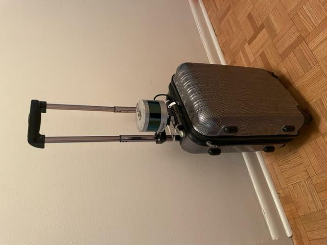

# Customization

## Build own cabot driver for your robot

- This repository uses `cabot-drivers` and `cabot-description` repositories for managing hardware components and describing the robot
    - these repositories will be imported by `./setup-dependency.sh` script which uses `vcs` command to import repos described in `dependency.repos` files
    - `cabot-navigation` repo also has dependency to `cabot-description` which is used for gazebo simulation
- You can modify those repositories and this `cabot` repos to build your own cabot-navigation compatible robot
    - simplest way is to fork those repositories to your own space, and modify `dependency.repos` to points to your repo
    - make sure all dependency.repos points to your forked repos
    - you may use `./setup-dependency.sh -c` to remove cloned repo first then run `./setup-dependency.sh` to clone correct one
```
- cabot
  - dependency.repos               <- modify
  - cabot-common
  - cabot-description
  - cabot-drivers
    - dependency.repos             <- modify
    - cabot-common
    - cabot-description
  - cabot-navigation
    - dependency.repos             <- modify
    - cabot-common
    - cabot-description
  - cabot-people
    - cabot-common
```

### requirements

- define own `CABOT_MODEL` for example `cabotX-1`
    - `CABOT_MAJOR` will be first 6 letters of your `CABOT_MODEL` (i.e., `cabot-X`)
- `cabot-descrption/cabot_description/robots/{CABOT_MODEL}.urdf.xacro.xml` (i.e., `cabotX-1.urdf.xacro.xml`)
    - this file will be used in `cabot-drivers` (pyshical robot) and `cabot-navigation` (gazebo simulation)
    - please refer to existing URDF descriptions and check [README of cabot-description](https://github.com/CMU-cabot/cabot-description)
- cabot-drivers will launch `cabot_base` `{CABOT_MAJOR}.launch.py` (i.e., `cabotX.launch.py)
    - you can modify launch script at `cabot-drivers/script/launch_driver.sh`
    - refers to the [README of cabot-drivers](https://github.com/CMU-cabot/cabot-drivers) to see required servies/topics

## Build own cabot site (map) for your environment

You can make your own cabot site for your real/simulated environment as a ros2 package.
The following examples contains multiple cabot sites (ros2 packages), but you can make your repo as a ros2 package.
`colcon build` will find your packages under `cabot-navigation/cabot_sites`.\

### Example cabot sites

- [cabot_sites_cmu](https://github.com/CMU-cabot/cabot_sites_cmu/tree/dev-ros2/cabot_site_cmu_3d)
- [cabot_sites_test](https://github.com/CMU-cabot/cabot_sites_test/tree/main/cabot_site_test_room)

### Deployment

- place cabot site package under `cabot-navigation/cabot_sites` directory
- run `./build-docker.sh -w`
- set `CABOT_SITE` to your cabot site package name

### Data structure

```
<cabot_site_package_name>/
├ package.xml                     - required, for ros2 package
├ CMakeLists.txt                  - required, for ros2 package
├ config/                         - required
├ server_data/                    - required
├ maps/                           - required
├ <cabot_site_package_name>/      - optional for test
└ worlds/                         - optional for gazebo
```

#### config

- config.yaml (config for cabot_ui_manager)
  ```
  map_server_host: localhost:9090/map
  initial_floor: 1
  lookup_dist: 1000
  protocol: http
  ```
- config.sh (config for shell script, file path can be any path)  
  ```sh
  #!/bin/bash

  ## $sitedir is ros package directory

  map=$sitedir/maps/<your-maps>.yaml # map config for real environment

  if [ $gazebo -eq 1 ]; then
      map=$sitedir/maps/<your-maps-gazebo>.yaml # map config for gazebo environment
      # only for gazebo
      world=$sitedir/worlds/<your>.world
      wireless_config=$sitedir/worlds/<your_wireless>.yaml
  fi
  ```

#### maps

- see next section

#### server_data

- see next section

#### test

- TBD

#### worlds

- can be any name, specified by `$world` in the config.sh


## Mapping with Cartographer

### Tips
- You need to walk around your environment with your robot or a device equipped suitcase to scan and build the map the place
  - walk slowly (less than 1.0m/s) and cover entire space
  - it would be better to have a round trip for all possible topology (corridors, rooms, spaces separated by large objects, and etc)
  - example of a device-equipped suitcase (using a [camera mount with a clamp](https://www.smallrig.com/smallrig-crab-shaped-clamp-magic-arm-with-ball-head-3724.html), IMU device would be mounted on the LiDAR)
    - 
### Required data, devices, and software
  - **Point clouds**: Velodyne VLP16, Hesai XT16, or similar LiDAR
  - **IMU**: Xsens, or BNO055 managed by Arduino or ESP32)
    - see [xsens_driver](https://wiki.ros.org/xsens_driver) for compatible devices
    - [Code for Arduino + BNO055](https://github.com/CMU-cabot/cabot-arduino)
      - tested with [Arduino Mega](https://store.arduino.cc/products/arduino-mega-2560-rev3)
    - [Code for ESP32 (WiFi) + BNO055](https://github.com/CMU-cabot/cabot-arduino-ace)
      - tested with [SparkFun Thing Plus](https://www.sparkfun.com/products/15663) + [BNO055](https://www.adafruit.com/product/4646) connected by a [Qwiic cable](https://www.adafruit.com/product/4399)
  - **WiFi signals**: ESP32 compatible device with WiFi antenna
    - [Code for ESP32 (WiFi)](https://github.com/CMU-cabot/WiFiScan)
      - tested with [ESP32 devkitc-v4](https://docs.espressif.com/projects/esp-idf/en/latest/esp32/hw-reference/esp32/get-started-devkitc.html)
  - **Bluetooth signals**: PC with Bluetooth
  - **CPU**: PC for Ubuntu20.04
### Data collection
  - [build docker images](../README.md#build-docker-images)
  - start scanning and walk.
    ```
    $ ./mapping-launch.sh -D -o TEST
    ```
    - wait about 15 seconds after running the command before starting data collection
  - examples
    ```
    $ ./mapping-launch.sh -o TEST -e           # use ESP32 for IMU with prefix TEST
    $ ./mapping-launch.sh -o TEST -x           # use XSENS for IMU with prefix TEST
    $ ./mapping-launch.sh -o TEST -a           # use Arduino for IMU with prefix TEST
    $ ./mapping-launch.sh -o TEST -S           # mapping gazebo world
    $ ./mapping-launch.sh -o TEST -L XT16      # use a non-default LiDAR model
    $ ./mapping-launch.sh -o TEST -D           # use the driver container
    ```
    - these commands record topics into a bag file for post processing
    - the bag file started with the prefix you specified can be found under `docker/home/recordings`
    - `CABOT_MODEL` (and `CABOT_TOUCH_PARAMS`) must be set when using `-D`; they are required by the driver container.
    - alternatively you can use cabot configuration, this records bags under `docker/home/.ros/log/<log dir>/ros2_topics`
      - you may need to hold the left button 3 seconds to disable motor power
    ```
    $ ./launch.sh -c <config>
    ```
### Post processing
  - run post processes the bag file (would be better to use PC with at least 6 core and 16GB)
    ```
    $ ./mapping-launch.sh -p <bag file> -D -g 0.1
    ```
  - examples with optional settings
    ```
    $ ./mapping-launch.sh -p <bag file> -w          # if the bag file is more than a few minutes, this option would be better
    $ ./mapping-launch.sh -p <bag file> -w -n       # the script will not skip previously completed tasks
    $ ./mapping-launch.sh -p <bag file> -s          # post process for gazebo mapping or recording by ./launch.sh
    $ ./mapping-launch.sh -p <bag file> -C          # convert the bag first
    $ ./mapping-launch.sh -p <bag file> -r 0.5      # run Cartographer with a slower play rate
    $ ./mapping-launch.sh -p <bag file> -L XT16     # use a non-default LiDAR model
    $ ./mapping-launch.sh -p <bag file> -D          # use when the bag was recorded with -D
    $ ./mapping-launch.sh -p <bag file> -g 0.1      # use a larger mapping grid size
    $ ./mapping-launch.sh -p <bag file> -G          # use GNSS fix topic for outdoor mapping
    $ ./mapping-launch.sh -p <bag file> -G -E 40.444192,-79.946654  # use a predefined ENU frame origin
    ```
    - post processes consist of 1) converting the bag if needed 2) running cartographer for SLAM 3) making map image files from cartographer submaps
    - `CABOT_MODEL` must be set because post processing uses the robot description to configure sensor TFs.
    - `-E` requires both `-p` and `-G`. It overrides the predefined ENU frame origin only in the temporary Cartographer configuration used for that run.
    - you can find the result under `docker/home/post_process` (the specified bag file will be copied here)

#### Issues with mapping a large environment?
  - run cartographer with reduced rate (like `-r 0.5`), if your computer has smaller number of cores
  - please consult at [Issues](/issues), you may need to configure cartographer params to get a better result

### Align the map to global coordinate
  - launch location tools server
    ```
    $ ./server-launch.sh -l
    $ xdg-open http://localhost:9091/tools
    ```
  - login with [default password](https://github.com/hulop/MapService/blob/master/MapService/SETUP.md#administration)
  - create a new DB for your new site and go to "CaBot Mapping" page for the DB
  - click "Import Mapping Data"
    - copy plain files (do not include bags directories) under `docker/home/post_process` directory to a new directory
    - select the directory to upload
  - edit the anchor of the image (world coordinate)
    - refresh the page make sure the data is the latest
    - click "map" button of a floorplan
    - you can type latitude and longitude if you know the approximate coordinate
    - otherwise, zoom out the map and find your place
    - input rotate value to align the image to the building shape on the map (if available)
    - if you want to use another map image to align a map image, click "map" of the another image first, and then click "map" of the map image you want to align. You can edit the anchor of the image which you "map" last.
    - click "save"
### Export data
- click "Export Maps (zip)" button to get `maps.zip`
- go to "Manage Floor Plan" view and click "Export for MapServer" to get `floormaps.zip`
- Setup localization data for your cabot_site
    - edit the following configuration files
      ```
      cabot_site_somewhere
      ├── CMakeLists.txt
      ├── config
      │   ├── config.sh
      │   └── config.yaml
      ├── maps (copy exported `maps.zip`)
      ├── package.xml
      └── server_data
         ├── attachments
         │   └── map (copy exported `floormaps.zip`)
         ├── MapData.geojson (see bellow)
         └── server.env
      ```  
### Setup server data for your cabot_site
  - [example](https://github.com/CMU-cabot/cabot_sites_cmu/tree/main/cabot_site_cmu_3d/server_data)
    ```
    MapData.geojson     # routes and POIS, so you may not have one at initially make the data
    server.env          # server environment (you may want to copy from the exemple and change the initial location)
    attachments/map     # see above
    ```
- Edit routes and POIs
  - launch MapService server
  ```
  $ ./server-launch.sh -p <your_cabot_site_name>
  ```
  - login with editor/editor account (for local setup)
  ```
  $ xdg-open http://localhost:9090/map/editor.jsp
  ```
  - edit routes and POIS
  - export MapData.geojson file and copy to the server_data folder
- More details about local MapService server can be found [here](local-map-service.md)