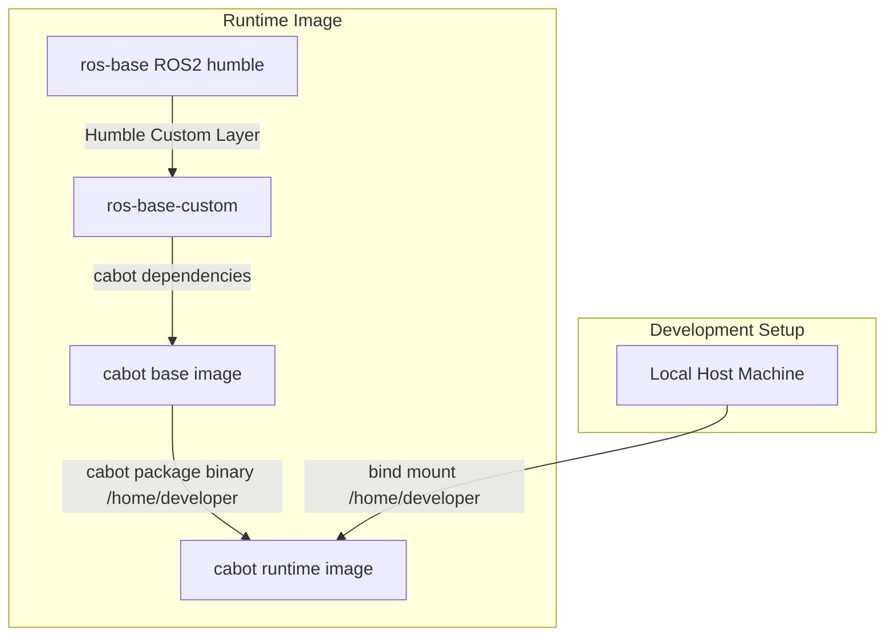

# Setup Dependencies

- Setup dependencies for development at the main branch (`ros2`)
  - `dependency.repos` will be used for the `vcs` command
  ```
  ./setup-dependency.sh -d
  ```

- Setup dependencies for development at non-main branch (ex. `ros2-dev`)
  - `dependency.repos` and `dependency-override.repos` will be used for the `vcs` command
  ```
  ./setup-dependency.sh -d -o
  ```

- Setup dependencies for release tag (ex. `v2.0.0`)
  - `dependency-release.repos` will be used for the `vcs` command
  ```
  ./setup-dependency.sh
  ```

## dependency files
- `dependency.repos` is the main dependency file, which is rarely changed
- `dependency-override.repos` is used to override the main dependency file, which is used for development branches
- `dependency-release.repos` is used for release tags, which is used for release builds


## Release
- If you push a tag which has a version number (ex. `v2.0.0`, `v2.0.0-beta1`), GitHub action makes a release zip file and then trigger the build at the build server
- The build server will download the zip file and setup the dependencies by `./setup-dependency.sh` (using dependency-release.repos)


## Daily build
- The main branch (`ros2`) and `./setup-dependency.sh -d` will be used for the daily scheduled build and tagged as `latest`, which should not be used for production


# Workspace build

- Follow the [README.md](../README.md) first until host workspace build, then build your workspace
  ```
  ./build-workspace.sh -w
  or
  ./build-workspace.sh -w -d        # run colcon build with --symlink-install option
  ```

- launch with the built workspace
  ```
  ./launch.sh -d                 # physical robot
  or
  ./launch.sh -s -d              # simulation
  ```

## Build docker images locally

- You can build your own docker images by executing the following command

  ```
  ./bake-docker.sh -i -t <tag>                # without specifying `-t`, it will override latest tag
  or
  ./bake-docker.sh -i -t <tag> -b <base-name> # if you want to use own base image, see the following
  ```

- If you want to customize base images (default=cmucal/cabot-base), go to cabot-common dir and run the following command
  ```
  cd cabot-common
  then
  ./bake-docker.sh -i                         # override cmucal/cabot-base:* locally
  or
  ./bake-docker.sh -i -b <base-name>          # build cmucal/<base-name>:* locally
  ```

### launch with the `<tag>` image

- Add `CABOT_LAUNCYH_IMAGE_TAG` to your .env file, it can override which tag of the images are used (default=latest)
  ```
  CABOT_LAUNCH_IMAGE_TAG=<tag>
  ```

### bake-docker.sh option detail

- `-i` specifies build locally (`-l`) with the platfrom (`-p`, linux/amd64 or linux/arm64) depending where the script is running
- `-l` indicates the build happens locally, without `-l` pushing images to dockerhub cmucal orgs
- `-p` indicates the build platform, without `-p` build multi platform images by usin qemu
- `-b` specifies the base name (default=cabot-base)
  - If you want to add extra software/packges into the base image use this feature

## Docker Images and docker compose
- The following diagram is a summary of the image structure (not accurate, see `cabot-common/docker-bake.hcl` for the detail)


- Docker images related to cabot are available at https://hub.docker.com/orgs/cmucal/repositories
  - Images are built by self-hosted runners owned by the core devleopment team
- Docker images now include cabot binary packages (not included before Jan. 2025, needed to build workspace)
- docker-compose files uses profiles
  - **prod**: run images without override
  - **build**: to build local workspace for development
  - **dev**: run images with the local workspace (override `/home/developer` in the container with your `./docker/home`)
  - **map**: for MapService server
  - **tools**: for LocationTools server

### Manage docker images script

deprecated

### Docker-compose files

[see docker](../docker) for details of each images.
Docker images manage required software/library to build and run CaBot packages.
Most of CaBot packages will not be built as docker image layers.

So, most ROS1/2 CaBot workspaces should be built after building/pulling docker images.
docker-compose files mount home directory (`docker/home`) and required CaBot packages into the corresponding workspace to keep built binaries on the host file systems.

`launch.sh` will select the proper docker-compose file to launch.

|File|Real/Simulation|Processor|Realsense|Description|
|---|---|---|---|---|
|docker-compose-common|-|x86_64|0-3|Common declaration|
|docker-compose|simulation|x86_64 + NVIDIA GPU|1|For development|
|docker-compose-nuc|simulation|x86_64|0|For development|
|docker-compose-rs3|simulation|x86_64 + NVIDIA GPU|3|For development|
|docker-compose-jetson|simulation|aarch64|1|For development|
|docker-compose-production|real|x86_64 + NVIDIA GPU|1|
|docker-compose-nuc-production|real|x86_64|0|
|docker-compose-rs3-production|real|x86_64 + NVIDIA GPU|3|3 Realsense|
|docker-compose-jetson-prod|real|aarch64|1|Including built workspace|
|docker-compose-mapping|real|x86_64|0|
|docker-compose-server|both|x86_64|-|local map service server|

## Other directories

|Package|Description|
|---|---|
|[cabot_debug](../cabot_debug)|debug utilities for logging output of command to check CPU/GPU status|
|[cabot_sites](../cabot_sites)|place cabot site packages|
|[doc](../doc)|documentation|
|[docker](../docker)|docker context and home directory to be mounted|
|[host_ws](../host_ws)|workspace for ROS running on host machine (mainly for debug)|
|[script](../script)|launch scripts for docker containers, utilities to plot from bag file|
|[tools](../tools)|install/setup scripts|

## Debug tools

### print_memo.py usage

- run cabot with recording bags
  - you need to record at least the following topics
    - /memo
    - /cabot/pose_log
- make /memo messages by clicking "memo" button on rviz panel
- stop cabot
- run the command
```
cd host_ws
colcon build --symlink-install
source install/setup.bash
ros2 run cabot_debug print_memo.py -f <bag file> -g > memo.geojson
```
- Import the memo.geojson file on the MapService editor
- save
- load all

### ./tools/play_bag.sh usage

You can see the rviz replay fo the recorded bag file

- need to build workspace first then run
```
./tools/play_bag.sh -r <play rate> -s <start time> <ros2 bag dir>

ex)
./tools/play_bag.sh -s 300 -r 10 docker/home/.ros/log/cabot_2025-01-24-13-16-49/ros2_topics/

```